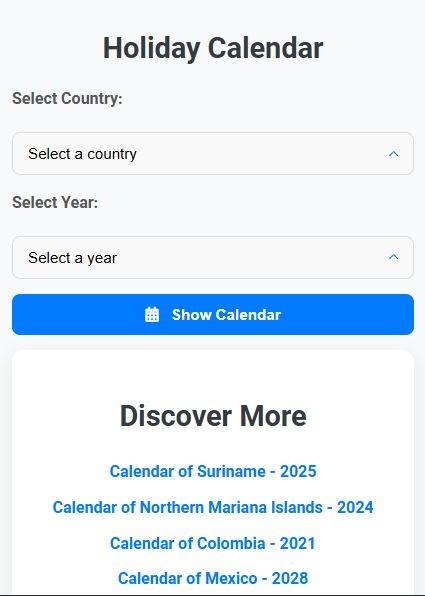
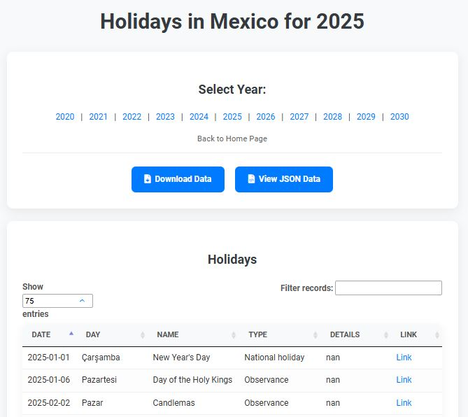

# Holiday Calendar Application

This is a Flask-based web application designed to provide aviation professionals with accurate and easily accessible holiday information for various countries and years. The application fetches data from an Excel file, allowing users to quickly view holiday calendars, download data for offline use, and access the information programmatically via a RESTful API.

## UI Appearance




## Features

*   **Comprehensive Holiday Data:** Access official holiday information for a wide range of countries and years, crucial for flight planning and scheduling.
*   **User-Friendly Interface:** A simple and intuitive web interface allows users to easily select a country and year to view the corresponding holiday calendar.
*   **Data Export:** Download holiday data as an Excel spreadsheet for offline analysis and integration with other tools.
*   **RESTful API Endpoint:** Access holiday data programmatically via a dedicated API endpoint, enabling integration with existing aviation systems and applications.
*   **Random Holiday Discovery:** Explore holidays for random countries and years directly from the homepage, providing inspiration for travel and cultural awareness.

## Technologies Used

*   **Backend:** Flask (Python) - A lightweight and flexible web framework for building the application's backend logic and API.
*   **Data Storage:** Pandas DataFrame (Excel file) - Used for storing and retrieving holiday data.
*   **Frontend:** HTML, CSS, JavaScript - Technologies used to create the user interface and provide a dynamic user experience.
*   **Dependency Management:** pip - Used for managing the project's dependencies.

## Project Architecture and Key Algorithms

The application follows a Model-View-Controller (MVC) architecture, with Flask handling the routing and controller logic, Pandas providing the data model, and HTML/CSS/JavaScript forming the view.

Key algorithms include:

*   **Data Filtering:** Efficiently filtering holiday data based on user-selected country and year.
*   **Data Formatting:** Converting date formats for display in the calendar and API responses.
*   **Random Data Generation:** Randomly selecting countries and years to provide a "Discover More" feature.

## Setup and Installation

Follow these steps to set up and run the application locally:

### 1. Clone the Repository

```bash
git clone https://github.com/your-username/holiday-calendar.git
cd holiday-calendar
```

### 2. Create a Virtual Environment (Recommended)

```bash
python -m venv venv
source venv/bin/activate  # On Windows: `venv\Scripts\activate`
```

### 3. Install Dependencies

```bash
pip install -r requirements.txt
```

### 4. Running the Application

```bash
python app.py
```

The application will be accessible at `http://127.0.0.1:5000/`.

## Usage

1.  **Select Country and Year:** On the homepage, choose a country and year from the dropdowns and click "Show Calendar".
2.  **View Holidays:** The calendar page will display a table of holidays for your selection.
3.  **Navigate Years:** Use the year links at the top to quickly switch between years for the same country.
4.  **Download Data:** Click the "Download Data" button to get an Excel file of the displayed holidays.
5.  **View JSON Data:** Click the "View JSON Data" button to see the raw JSON response from the API.
6.  **Discover More:** Use the "Discover More" section on the homepage to explore random holiday calendars.

## API Endpoint

The application provides a RESTful API endpoint to fetch holiday data:

`GET /api/holidays?country=<country_name>&year=<year_number>`

**Example:**
`http://127.0.0.1:5000/api/holidays?country=United%20States&year=2024`

## Contributing

Feel free to fork the repository, make improvements, and submit pull requests.

## License

This project is open source and available under the [MIT License](LICENSE).

## Dependencies

*   Flask
*   pandas
*   flask_cors
*   Gunicorn
*   pymongo
